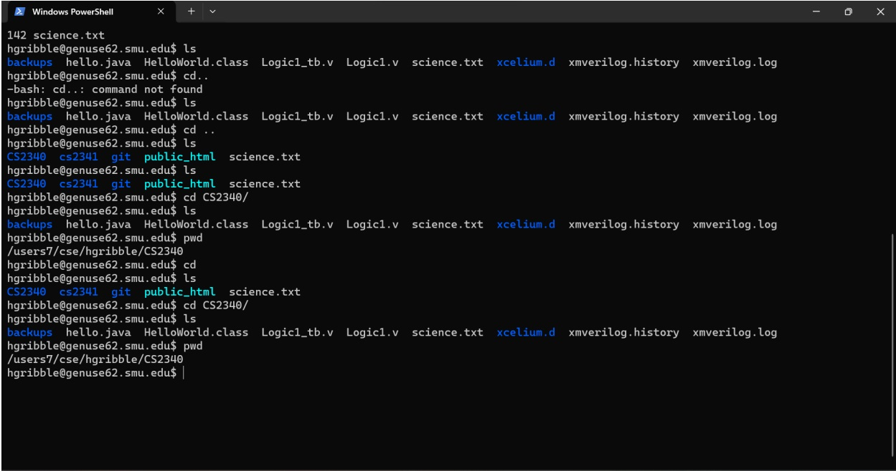

# Unix Tutorial and Genuse Server Setup
### Course: CS2340 - Computer Organization at SMU

This project introduces the Unix operating system and basic Unix commands. The tasks involved working with the **Lyle Genuse servers** as part of CS2340 coursework at Southern Methodist University.

## Project Overview
- **Unix Environment Setup**: 
  - Created a Genuse account to access the Lyle servers.
  - Configured a **Console Window** on the local PC to access the server via SSH.
  - Set up a **file transfer program** to transfer files between the local PC and the server.

- **Unix Commands Tutorial**:
  - Completed sections of the "UNIX Tutorial for Beginners" including **Tutorial One** and **Tutorial Two**.
  - Transferred the file `science.txt` to the server using a file transfer program.

- **Basic File Management Tasks**:
  - Created a subdirectory named `CS2340` in the **Parent directory**.
  - Changed to the `CS2340` directory using the `cd` command.
  - Used the `pwd` (print working directory) command to confirm the current working directory.
  - Created additional directories (`unixstuff` and `backups`) and navigated between them using `cd`.
  - Listed files and directories using `ls` and `ls -a` to view hidden files.
  - Learned about the directories `.` (current directory) and `..` (parent directory) to navigate efficiently.
  - Practiced **pathnames** to understand directory structure and relationships between files.

- **File Operations**:
  - **Copying Files**: Used `cp` to create a backup of `science.txt` as `science.bak`.
  - **Moving Files**: Used `mv` to move `science.bak` to the `backups` directory.
  - **Removing Files and Directories**: Used `rm` to remove files and `rmdir` to remove empty directories.
  - Created and removed a temporary directory (`tempstuff`) to practice directory management.

- **File Viewing and Searching**:
  - Displayed file contents using `cat`, `less`, `head`, and `tail`.
  - Searched for keywords in `science.txt` using `grep`, including using options like `-i` for case-insensitive searches.
  - Counted lines and words in files using `wc`.

## Skills Gained
- **Unix/Linux Environment**: Learned how to navigate and manipulate files and directories in a Unix system.
- **Remote Server Access**: Gained experience using remote servers and configuring **SSH connections**.
- **File Transfer**: Used SCP/SFTP for secure file transfers.
- **Basic Unix Commands**: Learned commands like `mkdir`, `cd`, `pwd`, `ls`, `cp`, `mv`, `rm`, `rmdir`, `cat`, `less`, `grep`, and `wc`, laying the foundation for further work in Unix-like environments.
- **File Viewing and Searching**: Gained proficiency in using tools to view and search the contents of files effectively.

## Example Commands
- **Create Directory**:
  ```bash
  mkdir CS2340
  ```
- **Change Directory**:
  ```bash
  cd CS2340
  ```
- **Print Working Directory**:
  ```bash
  pwd
  ```
- **List Files (including hidden files)**:
  ```bash
  ls -a
  ```
- **Copy File**:
  ```bash
  cp science.txt science.bak
  ```
- **Move File**:
  ```bash
  mv science.bak backups/.
  ```
- **Remove File**:
  ```bash
  rm tempfile.txt
  ```
- **Display File Contents**:
  ```bash
  cat science.txt
  ```
- **Search File for Keyword**:
  ```bash
  grep -i 'science' science.txt
  ```

## Exercises Completed
- **Exercise 1a**: Created a directory named `backups` inside the `unixstuff` directory.
- **Exercise 1b**: Used `cd`, `ls`, and `pwd` to explore the file system and understand directory navigation.
- **Exercise 2a**: Created a backup of `science.txt` by copying it to `science.bak`.
- **Exercise 2b**: Created and removed a directory named `tempstuff` to practice directory management.

## Screenshots
- **Sample Screenshot of Unix Commands**:
  

## Summary
The Unix Tutorial exercises provided hands-on experience with essential Unix commands for navigating and managing files and directories. The skills developed through these exercises are foundational for tasks like setting up file structures, managing backups, and navigating complex directory hierarchies in software development and system administration roles.

## Notes
- This project is useful for gaining familiarity with Unix systems, which are crucial in software engineering, system administration, and DevOps roles.
- The hands-on exercises covered fundamental commands that are commonly used in daily tasks involving Unix/Linux systems.
